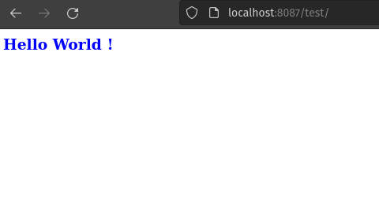
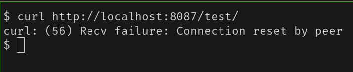
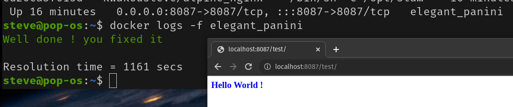

# SYSADMIN Challenges  

## NGINX series  

### NGINX 01  

>John wants to display a test page of a service at **https://localhost:8087/test/**  
the service is shipped through a docker container and should print "Hello World" : 

> Unfortunately, John is not able to display that. Instead he gets:  

> Can you help ?
if yes, pull the image, test it yourself and fix the mess!

* `docker pull kwakousteve/alpine_nginx`  
* `docker run -p 8087:8087 -d kwakousteve/alpine_nginx` 
* `docker logs -f $(docker ps -lq)` 

Once it is fixed, the container will exit with a success message:  

